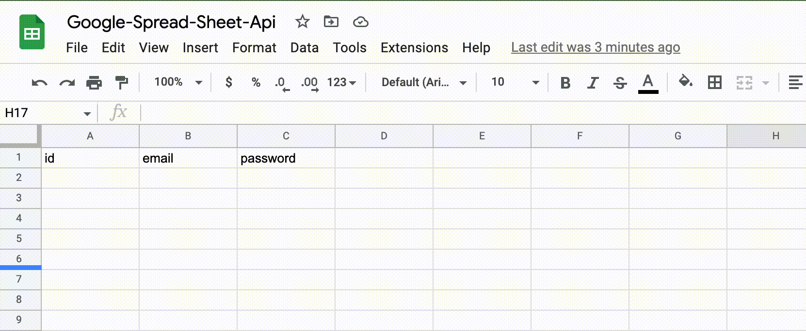
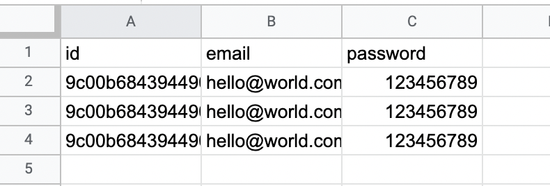

# google-sheets-api

This package is a wrapper for [googleapis](https://www.npmjs.com/package/googleapis) and guides you to setup google spread sheets api for basic operations such as getting rows with a certain structure in the sheet and inserting one or multiple rows.

## What the project does

### Insert data in a row:



### Get rows with a nice structure:

Let's say you have the following data in your excel spread sheet file:


If you execute the following command:

```typescript
const rows = await googleSheetsApi.getRows();
console.log(rows);
```

You'll get the following result:

```json
[
  {
    "id": "9c00b6843944908376c3539b07d128d5",
    "email": "hello@world.com",
    "password": "123456789"
  },
  {
    "id": "9c00b6843944908376c3539b07d128d5",
    "email": "hello@world.com",
    "password": "123456789"
  },
  {
    "id": "9c00b6843944908376c3539b07d128d5",
    "email": "hello@world.com",
    "password": "123456789"
  }
]
```

Important: The titles has to be in the first row. Otherwise it won't work.

## Requirements

- You need to have an account at [Google Cloud](https://cloud.google.com/)
- Google Cloud Project [Create Project](https://console.cloud.google.com/projectcreate)
- Enable Google Sheets [API Enable](https://console.cloud.google.com/apis/enableflow?apiid=sheets.googleapis.com)
- You need a Service Account for interacting from your code

### Once you create Service Account you need to share your spread sheet with the client email so that you won't get permission error [`The caller does not have permission`](https://stackoverflow.com/questions/38949318/google-sheets-api-returns-the-caller-does-not-have-permission-when-using-serve) which is a known issue.

## Usage

Import `GoogleSpreadSheetsApi` class:

```typescript
const { GoogleSpreadSheetsApi } = require("@gio-shara/google-sheets-api");
// or
import { GoogleSpreadSheetsApi } from "@gio-shara/google-sheets-api";
```

### Create instance of the class:

```typescript
const googleSheetsApi = new GoogleSpreadSheetsApi({
  spreadSheetId: process.env.SPREAD_SHEET_ID,
  scope: "write", // or "read"
  credentials: {
    clientEmail: process.env.GCP_CLIENT_EMAIL,
    privateKey: process.env.GCP_PRIVATE_KEY,
  },
});
```

#### Getting rows:

```typescript
const rows = await googleSheetsApi.getRows();
```

#### Inserting one or multiple rows:

```typescript
googleSheetsApi.insertRow(["1", "hello@world.com", "123456789"]);

// or

googleSheetsApi.insertRows([
  ["1", "hello@world.com", "123456789"],
  ["2", "hello2@world.com", "123456789"],
]);
```

### Contact

Let me guys know if I can improve something or implement a new feature. Request them on the following email `giorgi.sharashenidze@code.berlin`
